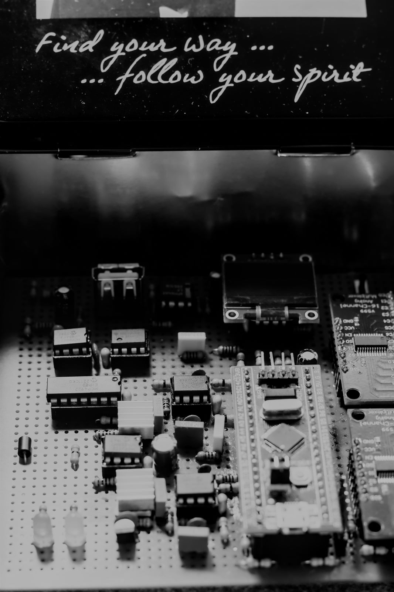
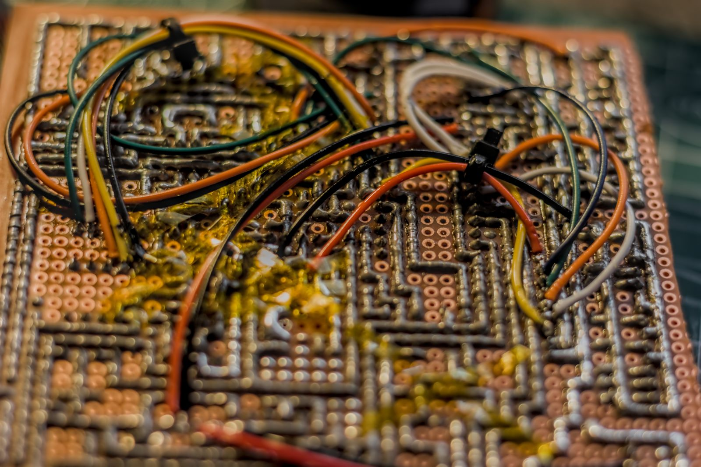
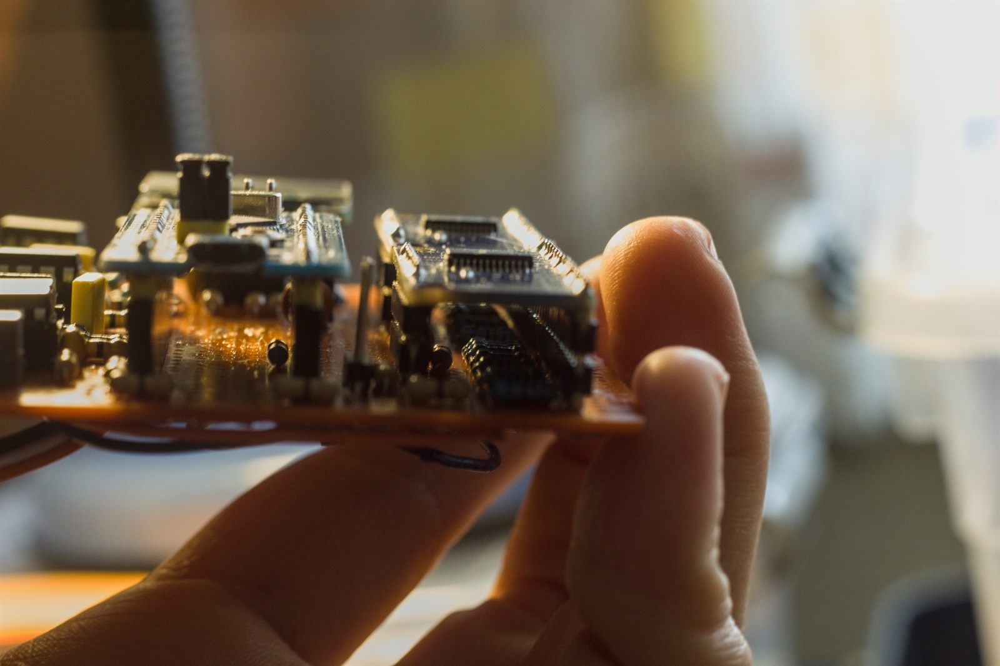
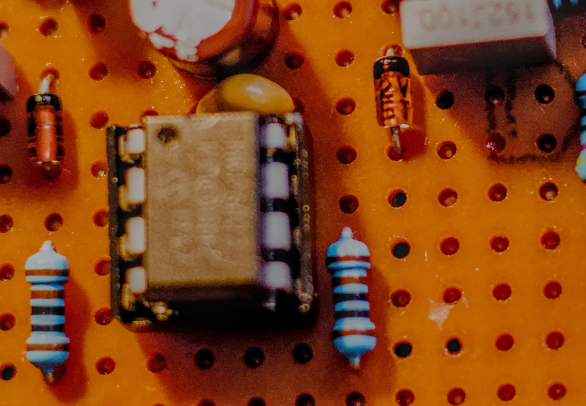
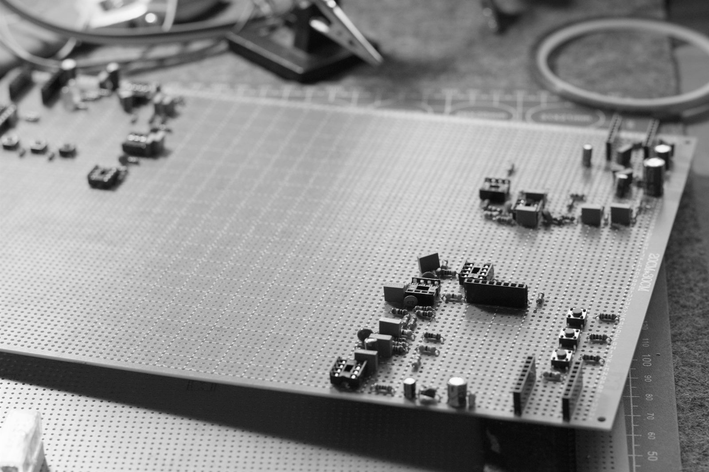
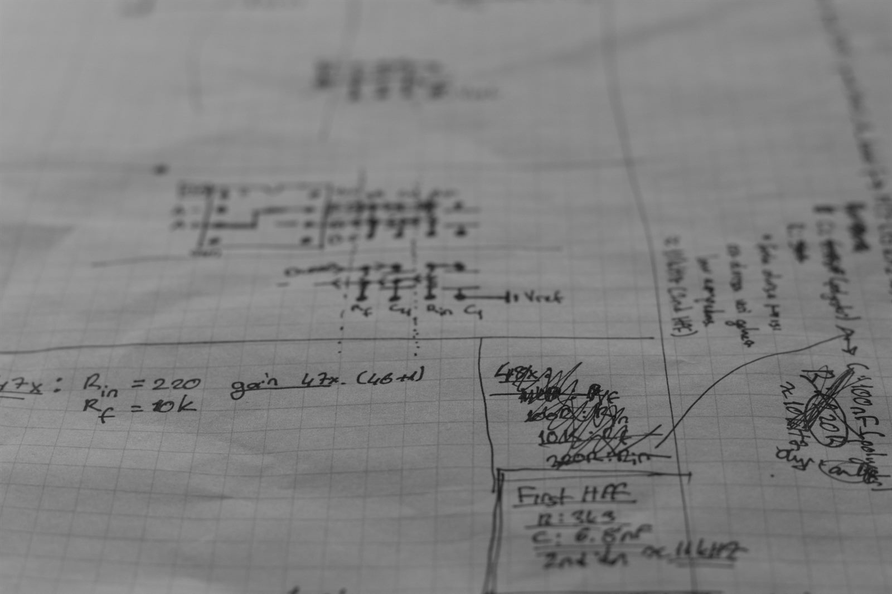

# CTH 0.1 — Can's Third Hardware

Bilgisayarların ürettiği "rastgele" sayılar rastgele değil. Hepsi bir formülün
çıktısı: aynı tohumu verirsen aynı diziyi alırsın — her seferinde, sonsuza
kadar. Zar atmak yerine hesap makinesiyle zar taklidi yapmak gibi bir şey.

Ben zarın kendisini istedim.

Bu kart iki adet 2.4 V zener diyotun fiziksel gürültüsünü dinliyor: iki
bağımsız kanaldan örnekliyor, her kanalı SP 800-90B sürekli sağlık
testlerinden geçiriyor, HMAC-SHA256 ile yoğunlaştırıp RTT üzerinden dışarı
veriyor. STM32F103 üzerinde Rust + [embassy](https://embassy.dev), `no_std`.

<p align="center">
  
  <br>
  <sub><i>CTH v.0.1, metal EMI kafesinin içinde. Kafes süs değil: 250–300×
  kazançla çalışan bir analog zincir, kafessiz haliyle odadaki her şeyi
  dinliyor — şebekeyi, telefonu, komşunun matkabını.</i></sub>
</p>

Tasarım süreci, analog tarafın bütün ayrıntıları ve daha fazla fotoğraf:
[CTH v.0.1 — Can's Third Hardware](https://can-eroglu.com/posts/cth-v.0.1/)

> **Ne olduğu, ne olmadığı.** Bunu en başa yazıyorum, çünkü bu alanda abartı
> bol ve ben o kalabalığa katılmak istemiyorum.
>
> Gürültünün fiziksel ve doğrusal olarak öngörülemez olduğu **ölçüldü**
> (aşağıda yöntem ve sayılar var). **Kaynağı da zenerler** — besleme hattına
> osiloskopla baktım. DAC bias kontrolü de çalışıyor, yani zenerler bilinen
> bir akımda sürülüyor.
>
> Mekanizma **saf** tünelleme değil ve bunu makalede de yazdım: bu gerilim
> sınıfında alan kristal kusurlarında yoğunlaşıyor, tünelleme oralarda
> lokalize oluyor ve üstüne bir boşalma döngüsü biniyor — **mikroplazma +
> tünelleme** (OnSemi HBD854). Tetikleyici hâlâ band-to-band tünelleme, yani
> süreç kuantum kökenli; sadece tek katmanlı değil, iki katmanlı.
>
> Fazla iddia etmediğim tek yer entropi **sınırı**: buradaki min-entropy sayısı
> AR(16) kalıntısından geliyor, yani doğrusal öngörülemezliği sınırlıyor —
> kuantum modelinden türetilmiş bir sınır değil. Ayrıca formal SP 800-90B
> sertifikası yok. Ayrıntı: [docs/entropy.md](docs/entropy.md).

---

## Sayılar

Bir RNG projesinde sorulması gereken soru "entropin kaç" değil, "bunu nereden
biliyorsun". O yüzden her satırın yanında nasıl elde edildiği yazıyor.

| büyüklük | değer | nasıl ölçüldü |
|---|---|---|
| **çıktı entropi yoğunluğu** (`RAW`) | **8.00 bit/bayt — tam entropi** | ölçülmedi, **türetildi**: 544 bit girdi ≥ 2 × 256 bit çıktı, SP 800-90C tam-entropi koşulu ([ayrıntı](docs/entropy.md)) |
| min-entropy (kaynak) | **3.34 – 3.71 bit/örnek** (*4-bitlik sıkıştırmada.*) | AR(16) ile öngörülebilir yapı çıkarıldıktan sonra |
| AR(16) kalıntı std | **Z1 197.5 / Z2 184.2 LSB** | ham std'nin ~%44'ü |
| ham örnekleme | **~28.5 körnek/s/kanal** | cihazda `Instant` ile ölçüldü |
| RCT en uzun tekrar | **5** (eşik 7) | 245.756 örnek boyunca |
| APT tepe | **51–53** (eşik 84, teorik ortalama 48.5) | 245.756 örnek boyunca |
| kirlilik | **~4.88 kHz harici ton**, varyansın %74'ü | 8 farklı örnekleme hızında doğrulandı |

Ölçüm aletini de ölçmek gerekiyor, yoksa sayıların anlamı yok. Analizöre
bilinen sinyaller verdim: saf ton → kalıntı 0.3 LSB, ramp → 0.0, beyaz
gürültü σ=400 → 390. Yani 190 LSB'lik "gürültü" okuması gerçekten gürültü,
aletin uydurması değil.

---

## Donanım

Piyasada "dandik" diye bilinen STM32F103C8T6 — Blue Pill. Birkaç dolar. Ama
içinde iki **bağımsız** ADC var ve bunlar çift modda eşzamanlı örnekleyebiliyor.
İki zeneri aynı anda okuyabilmek için ihtiyacım olan tek şey buydu; 20-50
dolarlık endüstriyel MCU'lara bakıp sonra buna dönmem birkaç günümü aldı.

Probe üzerinden okunan kimlik:

```
DBGMCU_IDCODE  0xE0042000 = 0x20036410   -> DEV_ID 0x410, medium-density
Flash size reg 0x1FFFF7E0 = 0x0040       -> 64 KB
```



Tek yüzlü pertinaks (FR2), elle lehimlendi. Empedans kontrolü yok, sinyal
bütünlüğü zayıf. Analog tarafta çektiğim zorluğun bir kısmı doğrudan bu
karttan geliyor — ve fotoğraf da bunu pek saklamıyor.

### Sinyal zinciri

```
  Zener --> [1. kat op-amp, sabit x51.0] --> [2. kat, R_f/R_in] --> ADC
                                                  ^
                                                  |
                                   HC4067 mux ile seçilen R_f
                                   (R_in = 470R sabit, R_f = 2k0 + ek)

  MCP4922 DAC --> op-amp (+)          I = V_DAC / R_sense
                  op-amp (-) <-- R_sense (1k)     [VCCS: bias akımı]
```

Kazanç tablosu [`src/drivers/hc4067.rs`](src/drivers/hc4067.rs) içinde: bağlı
kanallar 0, 1, 2, 3, 5, 7, 10, 11, 14. Diğer 7 kanalda fiziksel direnç **yok**
ve sürücü bunu `Option<u16>` ile tip seviyesinde zorluyor. Boş kanal seçmek
sessizce yanlış kazanç vermiyor, hata döndürüyor — çünkü analog tarafta
sessizce yanlış çalışan bir şey, gürültü ölçümünü fark ettirmeden zehirler.



Kazanç ayarı için önce trimpot denedim. Olmadı: karbon trimpot tek başına
100+ nV gürültü üretiyor, yani ölçmeye çalıştığım şeyin üstüne kendi
gürültüsünü koyuyor. Dijital pot da olmadı — her geçişte anahtarlama
sıçraması. Bir süre düşündükten sonra çözüm mux'tan geldi: 16'lı %1 metal film
direnç merdivenini HC4067 ile seçiyorum. Mux yalnızca seçim yapıyor, seçilen
yolun Johnson gürültüsü ise sabit ve hesaplanabilir. Hesaplanabilen gürültü,
gürültü sayılmaz.



Kaynak: iki adet 2.4 V zener.

### Pin haritası

| pin | işlev | | pin | işlev |
|---|---|---|---|---|
| PA0 | ADC1_IN0 — Zener 1 | | PB7 | MUX Z1 S0 |
| PA1 | ADC2_IN1 — Zener 2 | | PB6 | MUX Z1 S1 |
| PA5 | SPI1 SCK (DAC) | | PB12 | MUX Z1 S2 |
| PA7 | SPI1 MOSI (DAC) | | PA9 | MUX Z1 S3 |
| PA4 | DAC CS | | PA2 | MUX Z1 INH |
| PA3 | DAC LDAC | | PA15 | MUX Z2 S0 ¹ |
| PA6 | DAC SHDN (HIGH = aktif) | | PA10 | MUX Z2 S1 |
| PB8 | I2C1 SCL | | PB5 | MUX Z2 S2 |
| PB9 | I2C1 SDA | | PB4 | MUX Z2 S3 ¹ |
| PB1 | yeşil LED (veri) | | PB3 | MUX Z2 INH ¹ |
| PC13 | kart üstü LED (aktif düşük) | | PB10 | DS18B20 (ayrılmış) |

¹ **JTAG kapatılmadan kullanılamaz.** Firmware açılışta `SWJ_CFG =
JTAG_DISABLE` yapıyor; SWD açık kalıyor, yani debug kaybolmuyor. Bu yüzden
**SWD zorunlu, JTAG bir seçenek değil**.

I2C1 üzerinde: AT24C256 EEPROM `0x57`, SSD1306 OLED `0x3C`. EEPROM sadece
açılışta okunuyor, sonra bus ekrana devrediliyor — mutex gerekmiyor.

---

## Çalıştırmak

Bu kart tek nüsha ve bende. Yani aşağısı bir kurulum kılavuzu değil, nasıl
sürüldüğünün kaydı. Zincir `rust-toolchain.toml` ve `.cargo/config.toml` ile
sabitlenmiş; SWD probe takılıysa `cargo rr` flash'layıp RTT arayüzünü açıyor.

| komut | ne yapar |
|---|---|
| `cargo rr` | flash + tam ekran RTT arayüzü (`cargo embed --release`) |
| `cargo run --release` | flash + düz log akışı |
| `cargo sz` | bölüm bölüm flash/RAM tüketimi |
| `cargo test --lib --target <host>` | donanımsız birim testleri (21 test) |

Testlerde `--target` şart: `.cargo/config.toml` varsayılan hedefi
`thumbv7m-none-eabi` yapıyor, testler ise host'ta koşuyor.

### Çalışırken verilen komutlar

RTT down-channel üzerinden, `cargo rr` arayüzünde yazılıyor:

| komut | etki |
|---|---|
| `r` | **RAW** modu — doğrudan conditioner çıkışı. Her bit ölçülmüş fiziksel entropiye dayanır. Yavaş. |
| `d` | **DRBG** modu — HMAC_DRBG çıkışı. Hızlı, kriptografik olarak sağlam, ama deterministik genişletme. |
| `s` | durum raporu (sağlık payları, hız, toplam, tohum sayısı) |
| `h` | sağlık testlerini sıfırla (açılış testi baştan koşar) |

### Veriyi dışarı almak

Bayt akışı RTT kanal 1'de. `cargo-embed` TCP **istemci** olduğu için dinleyen
taraf host olmalı — `nc -l -p 19021 > random.bin`, sonra ayrı terminalde
`cargo rr`.

> `probe-rs run --target-output-file` bu iş için **kullanılmaz**. Çıktıyı metin
> sanıp UTF-8'e zorluyor: ölçtüm, 0x7F üstündeki her bayt U+FFFD ile
> değiştiriliyor ve araya ASCII zaman damgası enjekte ediliyor. Rastgele
> veride bunun anlamı, baytların yarısını sessizce çöpe atmak.

### Ham örnek dökümü

`dump` feature'ı normal hasat modunu kapatıp 12-bit ham örnekleri döküyor:
önce `python3 tools/analyze.py` (dinlemeye başlar), sonra
`cargo embed --release --features dump`.

Analizör aliasing kontrolünü, DAC etkisini, AR(16) kalıntısını ve min-entropy
tahminini tek raporda veriyor. Kalıntı yöntemini bilinen sinyallerle
doğruladım: beyaz gürültü σ=400 → 396, saf ton → 0.00, ton+σ=20 → 21.6,
ramp → 0.00.

---

## Mimari

```
ADC 12-bit
   |  alt 4 bit (nibble)           <- üst bitlerde ADC INL/DNL ve kazanç
   v                                  kayması birikiyor; ölçüldü
[health]   RCT + APT, KANAL BAŞINA, ham nibble üzerinde
   |       FAIL -> çıkış kesilir, kilitlenir
   v
bayt = (Z1_nibble << 4) | Z2_nibble
   |
   v
[conditioner]  160 bayt -> 32 bayt, zincirlenmiş HMAC-SHA256
   |           entropi bütçesi: 160 × 3.4 = 544 bit >= 512 bit (2.12× pay)
   |           => çıktı TAM ENTROPİ: 8.00 bit/bayt (SP 800-90C)
   +---> RAW modu
   |
   v
[drbg]  HMAC_DRBG (SP 800-90A), her yeni blokta yeniden tohumlanır
   |
   +---> DRBG modu
```

Bu sıralamada tek kritik nokta var: **sağlık testleri conditioner'dan önce
koşuyor.** Hash'ten sonra her şey rastgele görünür — bozuk kaynak dahil, zaten
hash'in işi bu. Kaynağı yakalayacaksan hash'ten önce yakalayacaksın. 

| dosya | içerik |
|---|---|
| [`src/board.rs`](src/board.rs) | pin haritası, saat, periferik kurulumu — tek tanım |
| [`src/drivers/`](src/drivers/) | MCP4922 DAC, HC4067 mux, AT24C256 EEPROM |
| [`src/entropy/health.rs`](src/entropy/health.rs) | RCT + APT + açılış testi |
| [`src/entropy/conditioner.rs`](src/entropy/conditioner.rs) | zincirlenmiş HMAC-SHA256 ekstraktör |
| [`src/entropy/drbg.rs`](src/entropy/drbg.rs) | HMAC_DRBG |
| [`src/ui.rs`](src/ui.rs) | OLED — sadece arkasında durabildiğim değerler |
| [`tools/analyze.py`](tools/analyze.py) | host analizörü |

Entropi mantığını `src/lib.rs` altında ayrı bir kütüphaneye aldım; donanımdan
bağımsız olduğu için host'ta `cargo test` ile koşuyor (21 test).

---

## Bilinen sorunlar

Çalışan bir cihazın da açıkları olur. Kapatamadıklarımı yazmazsam yukarıdaki
sayıların kıymeti kalmaz.

**1. ~4.88 kHz harici bir ton.** Varyansın %74'ü. Uzun süre aliasing sandım,
değilmiş: 8 farklı örnekleme hızında frekans Hz olarak sabit kalıyor, örnek
cinsinden periyot 5.75 → 23.27 kayıyor. Yani dışarıdan gelen gerçek bir
sinyal, örneklemeye kilitlenmiş bir artefakt değil. Kaynağını bulamadım;
analog beslemeyi üreten anahtarlamalı bir devre en güçlü aday. 35 µs örnekleme
süresinde alt nibble'ı bozmuyor, ama orada durması hoşuma gitmiyor.

**2. EEPROM kalibrasyon kaydında sağlama yok.** v1 formatında sadece magic
var; tek bit bozulma sessizce geçer. v2'de CRC-32 gelecek.

**3. `BUILD_EPOCH` bayat kalabilir.** Cargo build script'i her derlemede
koşmadığı için damga eskiyebiliyor. Geçici çözüm
`SOURCE_DATE_EPOCH=$(date +%s) cargo build --release`; kalıcısı zamanı
host'tan runtime'da almak — RTT komut kanalı bunun için zaten hazır.

---

## Durum ve sonraki adımlar

Entropi hattı çalışıyor ve ölçülmüş durumda. Kalanlar yukarıdaki üç madde ve
hiçbiri acil değil; bu bir ürün değil, benim kartım.

- **v0.2 — sağlamlık:** EEPROM kayıt formatına CRC-32 (madde 2), runtime
  zaman damgası (madde 3).
- **v0.3 — gürültü tabanı:** 4.88 kHz tonun kaynağını izole et (madde 1);
  analog besleme muhtemel şüpheli.
- **Uzun vade:** uzun süreli kararlılık ve sıcaklık aralığı ölçümü; NIST
  `ea_non_iid` ile uzun bir yakalama üzerinde resmî SP 800-90B tahmini.

### Kodun durumu hakkında

Bu firmware'i **Claude ile birlikte yazdım.** Özellikle driver ve sayısal analiz kısmını Claude yazdı. Optimizasyon
ve birkaç ufak bug halledilmeyi bekliyor — sürücülerde ve debug tarafında
gereksiz kodlar var *(Claude'nin over-engineering'i.)*, bunlar ya olgun kütüphanelerle değiştirilir ya da
kendi yazacağım çip sürücülerle. - *MCP4922* için - Bunlar ikinci sürümün işi; şu an için *acil* değil. 

> İkinci versiyon tasarımında.

Ölçüm tarafı bundan ayrı: bu belgedeki ve [docs/entropy.md](docs/entropy.md)
içindeki sayılar cihaz üzerinde alındı, `tools/analyze.py`'nin kalıntı yöntemi
de bilinen sinyallerle (saf ton, ramp, beyaz gürültü) ayrıca kalibre edildi.

*(Python'dan pek haz etmediğimden - 😒 Python tarafının tamamını Claude'ye yazdırdım.*)

---

## Buraya nasıl gelindi

<table>
<tr>
<td width="50%"></td>
<td width="50%"></td>
</tr>
</table>

Çalışan devre beşincisi.

Bütün hikâye, analog tarafın ayrıntıları ve daha fazla fotoğraf:
[can-eroglu.com/posts/cth-v.0.1](https://can-eroglu.com/posts/cth-v.0.1/)

---

## Lisans

MIT
